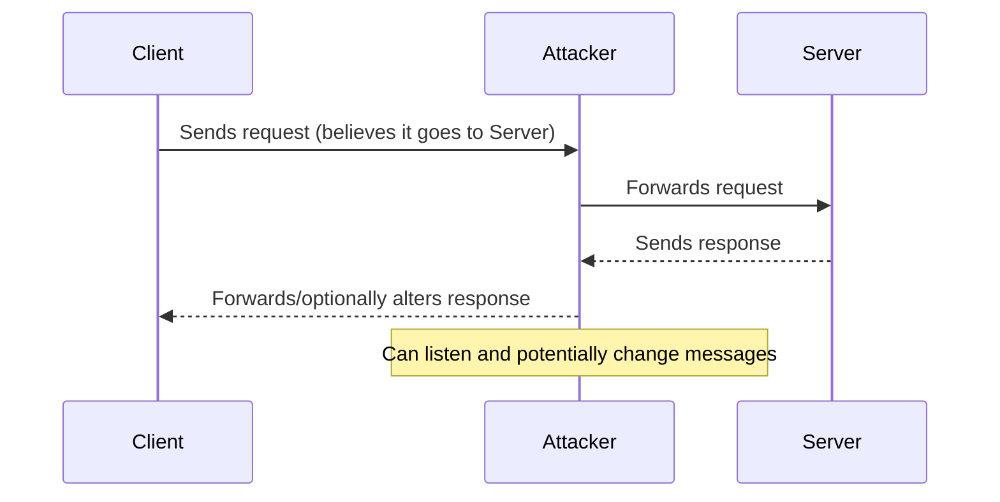
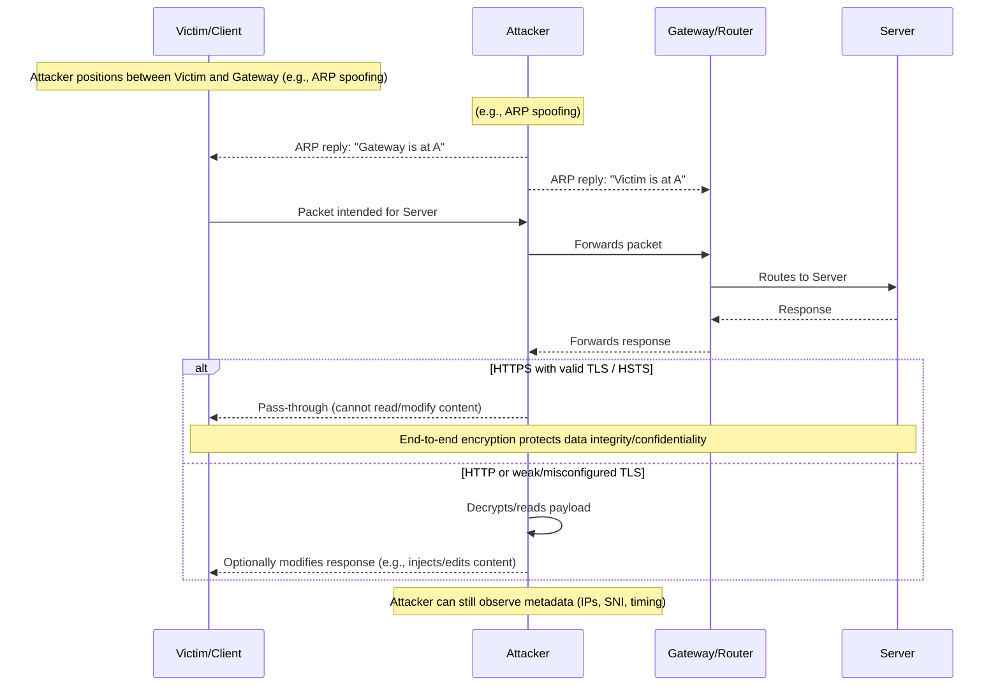

# Network Hacking Post Connection Attacks - MITM Attacks


- MITM stands for Man In The Middle. It is a type of attack where the attacker intercepts communication between two parties without their knowledge. The attacker can then eavesdrop on the conversation, modify the data being sent, or even impersonate one of the parties.

#### MITM: Layman sequence

A simple view showing the attacker silently sitting between a client and a server.



#### MITM: Detailed sequence

A more detailed flow including the network gateway and encryption considerations.



- A normal communication looks like this where the client communicates to the server via the gateway, and the thus the data obtained in response is as expected. The attacker can intercept this communication and modify the data being sent or received, if not securely encrypted with HTTPS or other secure protocols.

- In case, when a attacker gains access to the network, they can perform a MITM attack by intercepting the communication between the client and the server, the response from the server to the client is modified or altered, and the client receives the modified response. This can lead to various attacks such as data theft, session hijacking, or injecting malicious content into the communication.

## ARP Spoofing or ARP Poisoning

- It allows us to redirect the flow of packets in the network. So, instead of the packets going to the intended device, they go to the attacker, allowing them to intercept, modify, or even drop the packets.
  
  So, any request made by the client or the response from the server will have to flow through the attacker, allowing them to perform a MITM attack. This allows us to read the information, modify it or drop it, and even inject malicious content into the communication.

- The reason this is possible is ARP is not really secure. To understand this, we need to have some knowledge about what ARP is.

> [!IMPORTANT]
> 
> - ARP stands for Address Resolution Protocol, which is used to map IP addresses to MAC addresses in a local network. 
> - ARP spoofing or ARP poisoning is a technique used by attackers to send false ARP messages over a local area network (LAN).
> - This allows the attacker to associate their MAC address with the IP address of another device, effectively redirecting traffic intended for that device to themselves.

- How this actually works is, let's say we have Systems `A`, `B`, `C`, and `D`. Let's say A wants to communicate with C. For this purpose it needs to know the MAC address of C, so that it can communicate with the client.
  
  So, what the client does is it uses the ARP Protocol. Basically, it sends an ARP Request to all the clients on the network saying "Who has XX.XX.XX.XX??". So, all the devices will ignore the packet except the one that has the IP address XX.XX.XX.XX, which is C in this case. As, a result `C` will respond with an ARP Response, and will say "I have XX.XX.XX.XX, and my MAC address is XX:XX:XX:XX:XX:XX". Now, `A` has the MAC address of `C`, and it can communicate with it. So, this is how ARP works.

- Each computer has it's own ARP Table, which links IP Address on the same network to their MAC Addresses. YOu can get it on Kali Linux by using the command:

  ```bash
  root@kali:~# arp -a
  ```
  
  For example:

  ```bash
  root@kali:~# arp -a
  _gateway (IP_1) at MAC_1 [ether] on eth0
  _gateway (IP_2) at MAC_2 [ether] on wlan0
  ? (IP_3) at MAC_3 [ether] on eth0
  ```