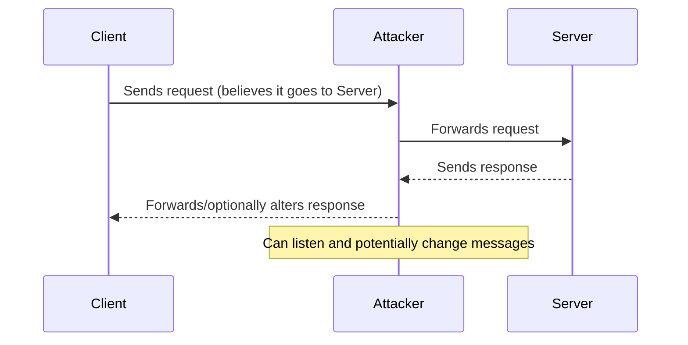
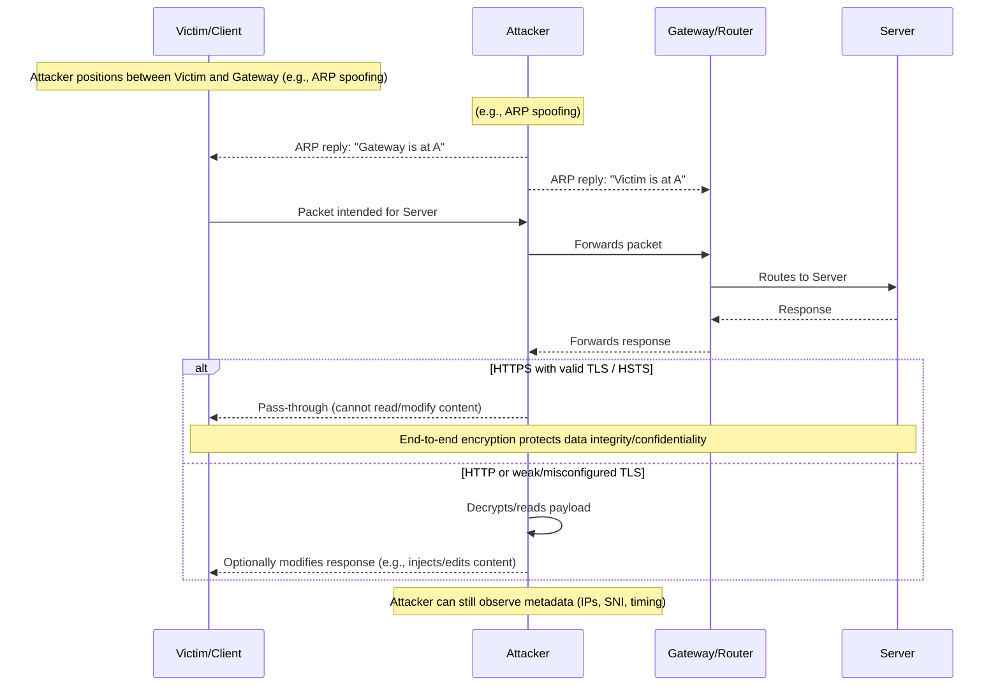

# Network Hacking Post Connection Attacks - MITM Attacks

- [Network Hacking Post Connection Attacks - MITM Attacks](#network-hacking-post-connection-attacks---mitm-attacks)
      - [MITM: Layman sequence](#mitm-layman-sequence)
      - [MITM: Detailed sequence](#mitm-detailed-sequence)
  - [ARP Spoofing or ARP Poisoning](#arp-spoofing-or-arp-poisoning)
    - [Why ARP Spoofing is Possible](#why-arp-spoofing-is-possible)
  - [Intercepting Traffic using ARP Spoofing](#intercepting-traffic-using-arp-spoofing)
    - [Why use `arpspoof` ??](#why-use-arpspoof-)
  - [Bettercap basics](#bettercap-basics)
    - [ARP Spoofing using Bettercap](#arp-spoofing-using-bettercap)
      - [`bettercap` parameters in ARP Spoofing](#bettercap-parameters-in-arp-spoofing)
    - [Spying on Network Devices](#spying-on-network-devices)


- MITM stands for Man In The Middle. It is a type of attack where the attacker intercepts communication between two parties without their knowledge. The attacker can then eavesdrop on the conversation, modify the data being sent, or even impersonate one of the parties.

#### MITM: Layman sequence

A simple view showing the attacker silently sitting between a client and a server.



#### MITM: Detailed sequence

A more detailed flow including the network gateway and encryption considerations.



- A normal communication looks like this where the client communicates to the server via the gateway, and the thus the data obtained in response is as expected. The attacker can intercept this communication and modify the data being sent or received, if not securely encrypted with HTTPS or other secure protocols.

- In case, when a attacker gains access to the network, they can perform a MITM attack by intercepting the communication between the client and the server, the response from the server to the client is modified or altered, and the client receives the modified response. This can lead to various attacks such as data theft, session hijacking, or injecting malicious content into the communication.

## ARP Spoofing or ARP Poisoning

- It allows us to redirect the flow of packets in the network. So, instead of the packets going to the intended device, they go to the attacker, allowing them to intercept, modify, or even drop the packets.
  
  So, any request made by the client or the response from the server will have to flow through the attacker, allowing them to perform a MITM attack. This allows us to read the information, modify it or drop it, and even inject malicious content into the communication.

- The reason this is possible is ARP is not really secure. To understand this, we need to have some knowledge about what ARP is.

> [!IMPORTANT]
> 
> - ARP stands for Address Resolution Protocol, which is used to map IP addresses to MAC addresses in a local network. 
> - ARP spoofing or ARP poisoning is a technique used by attackers to send false ARP messages over a local area network (LAN).
> - This allows the attacker to associate their MAC address with the IP address of another device, effectively redirecting traffic intended for that device to themselves.

- How this actually works is, let's say we have Systems `A`, `B`, `C`, and `D`. Let's say A wants to communicate with C. For this purpose it needs to know the MAC address of C, so that it can communicate with the client.
  
  So, what the client does is it uses the ARP Protocol. Basically, it sends an ARP Request to all the clients on the network saying "Who has XX.XX.XX.XX??". So, all the devices will ignore the packet except the one that has the IP address XX.XX.XX.XX, which is C in this case. As, a result `C` will respond with an ARP Response, and will say "I have XX.XX.XX.XX, and my MAC address is XX:XX:XX:XX:XX:XX". Now, `A` has the MAC address of `C`, and it can communicate with it. So, this is how ARP works.

- Each computer has it's own ARP Table, which links IP Address on the same network to their MAC Addresses. YOu can get it on Kali Linux by using the command:
  
  ```bash
  root@kali:~# arp -a
  ```
  
  For example:
  
  ```bash
  root@kali:~# arp -a
  _gateway (IP_1) at MAC_1 [ether] on eth0
  _gateway (IP_2) at MAC_2 [ether] on wlan0
  ? (IP_3) at MAC_3 [ether] on eth0
  ```

- If we do the same on windows we get the following output:

  ```cmd
  C:\Users\IEUser>arp -a
  
  Interface: Interface_IP --- 0x7
    Internet Address      Physical Address      Type
    IP_1                  MAC_1                 dynamic
    IP_2                  MAC_2                 dynamic
    IP_3                  MAC_3                 static
  ```

  We can clearly see that it's mapping the IP addresses to their MAC addresses respectively. This MAC Address can be easily modified by using the ARP Protocol.

- So, what we can do is we will exploit the ARP Protocol, and send 2 ARP responses. One to the client and one to the gateway. The ARP response to the client will say "The MAC address of the gateway is XX:XX:XX:XX:XX:XX", and the ARP response to the gateway will say "The MAC address of the client is XX:XX:XX:XX:XX:XX". This way, we can redirect the flow of packets in the network, and perform a MITM attack.

### Why ARP Spoofing is Possible

- ARP is a stateless protocol, meaning it does not verify the authenticity of the sender. This allows attackers to send false ARP messages without any verification.

- Client accepts the response even if they didnot make the request. This means that if an attacker sends a false ARP response, the client will accept it without verifying if it was expecting a response.

## Intercepting Traffic using ARP Spoofing

- In order to do so, we need to know the IP addresses of the client and the gateway. We can use the `netdiscover` tool to find the IP addresses of the devices on the network.

  ```bash
  root@kali:~# netdiscover -i wlan0
  ```

  Once, the IP addresses are known, we can use the `arpspoof` tool to send the false ARP responses to the client and the gateway.

  ```bash
  root@kali:~# arpspoof -i <interface_name> -t client_ip gateway_ip
  ```

  ```bash
  root@kali:~# arpspoof -i <interface_name> -t gateway_ip client_ip
  ```

  It would look something like this:

  .png)
  .png)

- As, you can clearly see the MAC Address of the gateway has been changed to the MAC Address of the attacker. This means that all the packets that are intended for the gateway will now be sent to the attacker.

- Now we need to allow packets to be forwarded. This can be done by enabling IP forwarding on the attacker's machine.

  ```bash
  root@kali:~# echo 1 > /proc/sys/net/ipv4/ip_forward
  ```

### Why use `arpspoof` ??

- We could have used `ettercap` to perform the ARP spoofing, but the reason we are using `arpspoof` is because it is a lightweight tool that does not have a GUI. This means that it does not consume a lot of resources, and it is easier to use in a script.

## Bettercap basics

- `bettercap` is a powerful, flexible and portable tool created to perform various types of MITM attacks against a network, manipulate HTTP, HTTPS and TCP traffic in real-time, sniff for credentials and much more.
- It is a complete rewrite of the well known `ettercap` tool, and it is written in Go programming language. It can not only perform ARP spoofing, but it can also perform DNS spoofing, HTTP/HTTPS manipulation, and much more.

- To start using `bettercap`, we need to start the `bettercap` tool with the following command:

  ```bash
  root@kali:~# bettercap -iface <interface_name>
  ```

- This will start the `bettercap` tool and open the interactive shell. We can then use the `help` command to see the list of available commands.

  ```bash
  bettercap > help
  ```

- Let's say we want to scan for the devices on the network, we can use the `net.probe on` command to scan for the devices on the network.

  ```bash
  net.probe on
  ```

- This will scan for the devices on the network and display their IP addresses, MAC addresses, and hostnames.


  ```bash
  192.168.175.0/24 > 192.168.175.129  » net.probe on
  [06:29:59] [sys.log] [inf] net.probe starting net.recon as a requirement for net.probe
  [06:29:59] [endpoint.new] endpoint 192.168.175.254 detected as 00:50:56:e5:67:d9 (VMware, Inc.).
  [06:29:59] [endpoint.new] endpoint 192.168.175.130 detected as 00:0c:29:23:e8:71 (VMware, Inc.).
  192.168.175.0/24 > 192.168.175.129  » [06:29:59] [sys.log] [inf] net.probe probing 256 addresses on 192.168.175.0/24
  192.168.175.0/24 > 192.168.175.129  » [06:29:59] [endpoint.new] endpoint 192.168.175.1 detected as 00:50:56:c0:00:08 (VMware, Inc.).
  192.168.175.0/24 > 192.168.175.129  » [06:30:20] [endpoint.lost] endpoint 192.168.175.130 00:0c:29:23:e8:71 (VMware, Inc.) lost.
  ```

  This is another way of discovering connected clients quickly using bettercap. What we didn't notice is when we started the `net.probe on` command, it automatically started the `net.recon` command as a requirement for `net.probe`. This means that it is continuously scanning for new devices on the network. So, now if you do `help` again, you will see that the `net.recon` command is also running.

  .png)

  The reason for this is because the net.probe sends probe request to all possible IPs, and than if we get a response the net.recon will be the one detecting the response by monitoring my ARP Cache, and than adding all of these IPs in a nice list, so we can target them.

- We can use `net.show` command to see the list of devices on the network.

  ```bash
  net.show
  ```

  This will display the list of devices on the network along with their IP addresses, MAC addresses, and hostnames.

  .png)

  Here, we can see there IPs, corresponding MAC Addresses, and it can also show you information about each one of these IPs. 
  
### ARP Spoofing using Bettercap

  Now to perform the ARP spoofing, we can use the `arp.spoof` command to enable ARP spoofing. Let's first see how to activate this command.

  .png)

  So, here we can clearly seedsad   that we can use the `arp.spoof on` command to turn this module on. We can do `arp.ban on` this will literally just cut the connection to the target. We can do `arp.spoof off` to turn it off.

#### `bettercap` parameters in ARP Spoofing

- Anything under the parameters is something we can set in the module. So, now we will be seeing how to modify some of these option. Let's go through one of the options `arp.spoof.fullduplex`.

- If it is set to `true`, it will perform a full duplex attack, meaning it will spoof both the target and the gateway. If it is set to `false`, it will only spoof the target. It is set to `false` by default because if the ARP Spoofing Protection is enabled on the gateway, it will detect the ARP spoofing attack and will block the attacker from sending ARP responses to the gateway.

- If you want to set it to `true`, you can use the following command:

  ```bash
  set arp.spoof.fullduplex true
  ```

  In a similar fashion, we need to set the target as well.

  ```bash
  set arp.spoof.targets <target_ip>
  ```

- Now, we can use the `arp.spoof on` command to start the ARP spoofing attack.

  ```bash
  arp.spoof on
  ```

- If we want to run this as 1 command, we can use the following command:

  ```bash
  set arp.spoof.fullduplex true;set arp.spoof.targets <target_ip>;arp.spoof on
  ```

  .png)

  Now, if we check the Target Windows Vm, we can clearly see, the MACs changed.

  .png)

  - If we see, the output of `help` it clearly shows `arp.spoof` is running.

  - Also, when we check the output for `arp -a` on the Windows VM, we can see that the MAC address of the gateway has been changed to the MAC address of the attacker. This means that all the packets that are intended for the gateway will now be sent to the attacker.

The same can be performed using our automated script as well which is at the specified [location](../python-scripts/bettercap_arp_spoofing_script.py).

### Spying on Network Devices 

- So, far we have learnt how to perform ARP spoofing using bettercap. Now, we will see how to spy on the network devices using bettercap.