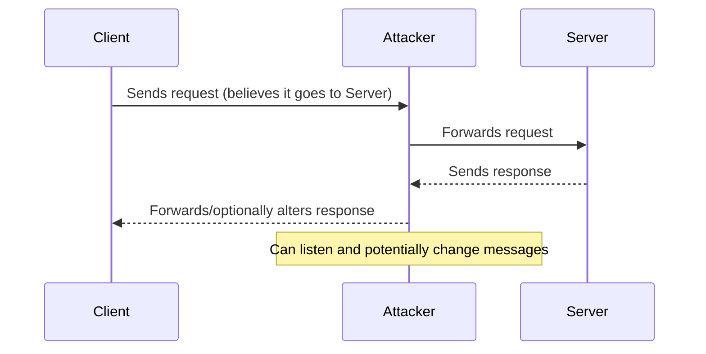
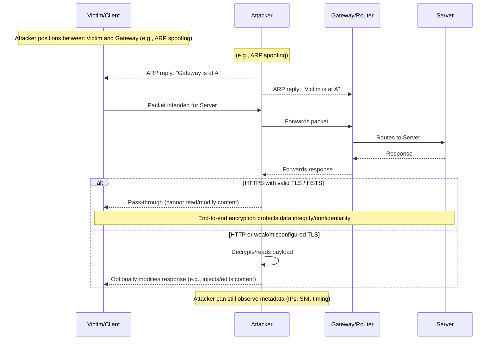

# Network Hacking Post Connection Attacks - MITM Attacks

- MITM stands for Man In The Middle. It is a type of attack where the attacker intercepts communication between two parties without their knowledge. The attacker can then eavesdrop on the conversation, modify the data being sent, or even impersonate one of the parties.

#### MITM: Layman sequence

A simple view showing the attacker silently sitting between a client and a server.

#### MITM: Detailed sequence

A more detailed flow including the network gateway and encryption considerations.

