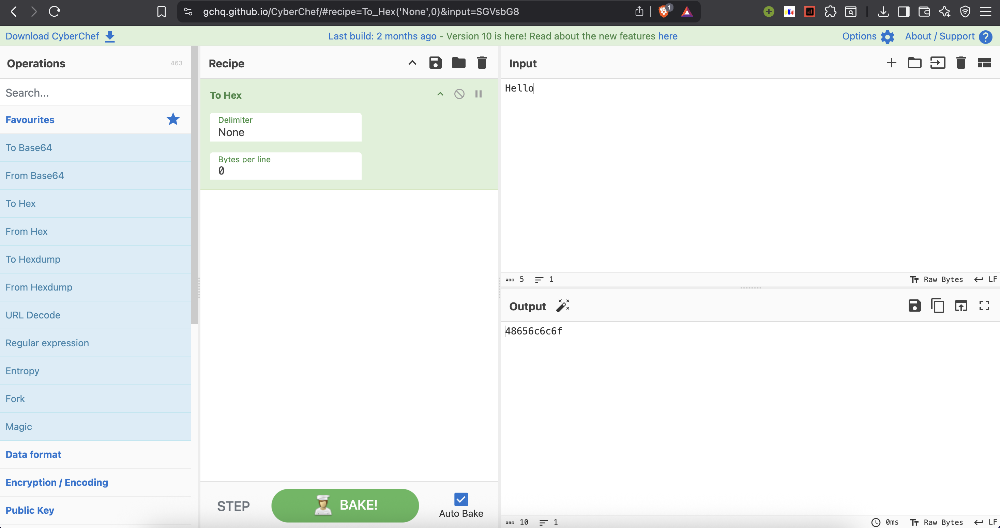

# CyberChef – The Cyber Swiss Army Knife 🛠️

## 📌 What is CyberChef?

CyberChef is a web-based tool created by GCHQ (UK's Government Communications Headquarters) to perform a wide range of data analysis, encryption, encoding, and decoding tasks.

It’s often called the **“Cyber Swiss Army Knife”** because it provides hundreds of built-in “operations” that can be combined like recipes to process data.

CyberChef is widely used in:
* Cybersecurity (CTFs, forensic investigations, malware analysis)
* Data Encoding/Decoding (`Base64`, URL encoding, `Hex`, `Binary`)
* Cryptography (`XOR`, `AES`, hashing)
* Everyday troubleshooting (unescaping characters, parsing JSON, etc.)

---

## ⚙️ Tools & Features of CyberChef

CyberChef works using **recipes** – you drag and drop operations from the left panel to process your data in the middle panel, and instantly view the results in the right panel.

### 🔑 Common Operations:

1.  **Encoding / Decoding**
    * `Base64 Encode` / `Decode`
    * `URL Encode` / `Decode`
    * `From Hex` / `To Hex`

2.  **Encryption / Decryption**
    * `XOR` (with a key)
    * `AES Encrypt` / `Decrypt`
    * `ROT13`

3.  **Data Conversion**
    * `To Binary` / `From Binary`
    * `To Octal` / `From Octal` / `To Decimal` / `From Decimal`
    * Character Encoding (`UTF-8`, `ASCII`)

4.  **Hashing**
    * `MD5`, `SHA-1`, `SHA-256`
    * `HMAC`

5.  **Data Analysis**
    * `Entropy` calculation
    * `Frequency analysis` (helpful in cryptography)

6.  **Utilities**
    * `Find / Replace`
    * `Split` / `Join`
    * `Extract URLs`, `Extract IP addresses`, or `Extract Email addresses`

---

## 🧪 Example

Here's a simple example of how a recipe works.

* **Input:**
    ```
    Hello
    ```
* **Recipe:**
    1.  `To Hex`
* **Output:**
    ```
    48656c6c6f
    ```



If you then add the `From Hex` operation to the recipe, it will convert the hex back to the original text, `Hello`. This shows how you can chain multiple steps to build a complex data processing pipeline.

Explore [CyberChef Official Website](https://gchq.github.io/CyberChef/) and enjoy the use of different recipes.

---

## 📚 More Reading Material

* [CyberChef GitHub Repository](https://github.com/gchq/CyberChef)
* [An Introduction to CyberChef (DFIR Diva Blog)](https://www.dfirdiva.com/an-introduction-to-cyberchef/)
* [CyberChef Room on TryHackMe (Hands-on Practice)](https://tryhackme.com/room/cyberchef)

---

## 🎯 Key Takeaways

* CyberChef is an all-in-one tool for data processing, cryptography, and encoding.
* You can combine multiple steps (recipes) to solve complex problems.
* It is an essential tool for students, security professionals, and CTF players.