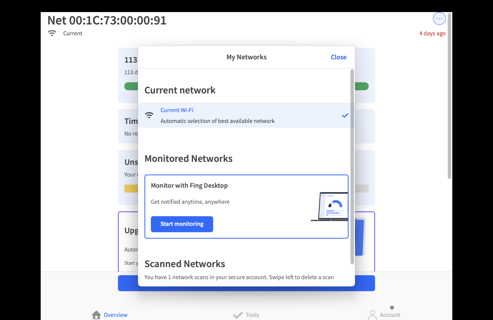
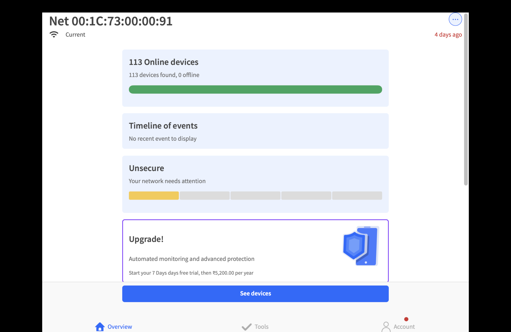
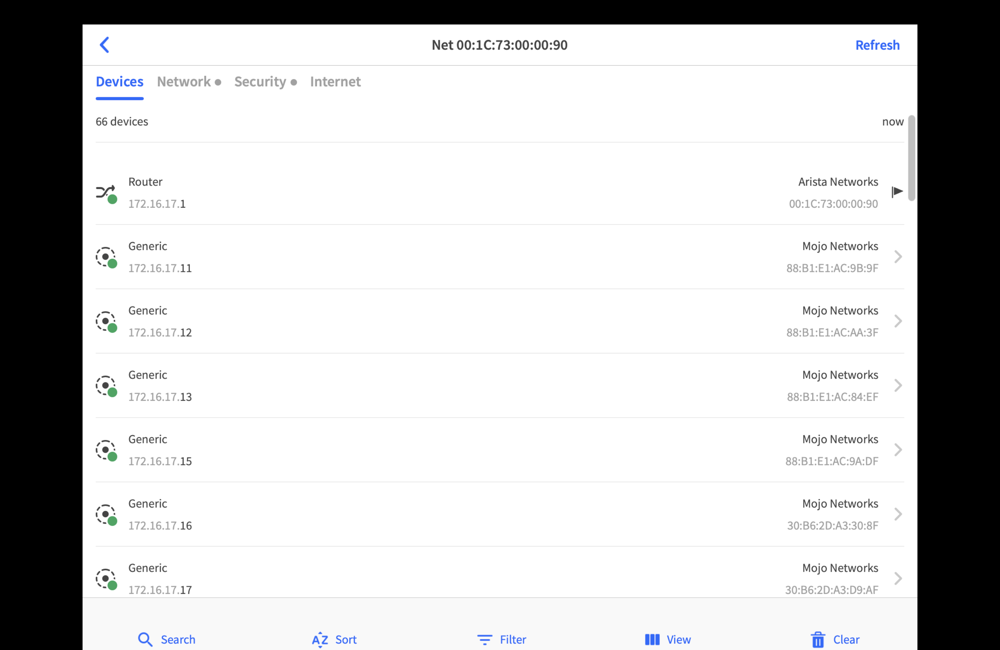
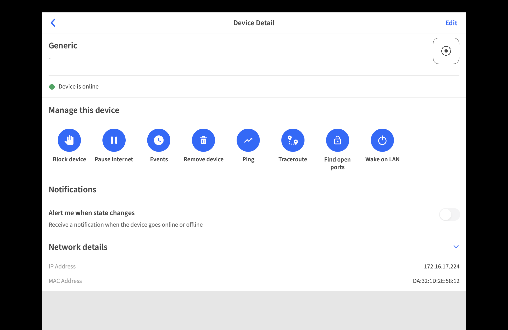

# Lesson: Introduction to Network Scanning with Fing

Welcome, future ethical hackers! The very first step in any security assessment is **reconnaissance**. Before you can test a system's defenses, you must first understand what you're up against. What devices are on the network? What services are they running? This initial mapping phase is critical, and today, we're learning about one of the most user-friendly tools for the job: **Fing**.

Think of Fing as the sleek, graphical user interface (GUI) version of the powerful command-line tool, `nmap`. It's fast, easy to use, and available on your phone (iOS/Android) and desktop, making it perfect for quick, initial scans.

---

## What Fing Does: Key Features for Reconnaissance

Fing is designed to give you a quick and clear picture of a network. For an ethical hacker, these are its most valuable features:

### 1. Network Discovery & Device Inventory

When you first connect to a network (with permission!), your primary goal is to create an inventory. Fing excels at this by scanning the local network and listing every device it finds.

For each device, Fing tries to identify:
* **IP Address**: The device's unique network address (e.g., `192.168.1.101`).
* **MAC Address**: The unique hardware address of the device's network card. This can help you identify the manufacturer.
* **Hostname**: The name of the device on the network (e.g., `davids-macbook-pro`).
* **Vendor**: The manufacturer (e.g., Apple, Dell, Netgear), identified from the MAC address.

**Use Case:** This feature is your starting point for mapping the network. It helps you identify known assets and, more importantly, spot unknown or unauthorized devices that shouldn't be there.

### 2. Open Port & Service Finding

This is where Fing becomes incredibly useful for security assessments.

* **What are ports?** If a device's IP address is its street address, **ports** are the numbered doors into that building. There are 65,535 possible ports, and different services (like websites or remote access tools) listen for connections on specific "doors."
* **How does Fing help?** Fing can run a port scan on a specific device to see which of these doors are open. An open port means a service is likely running and listening for a connection—a potential entry point.

Fing will identify common open ports and guess the service running on them:

| Common Port | Service        | What it means                                      |
|-------------|----------------|----------------------------------------------------|
| `22/TCP`    | SSH (Secure Shell) | A secure channel for remote command-line access.   |
| `80/TCP`    | HTTP           | A web server is running.                           |
| `443/TCP`   | HTTPS          | A secure web server is running.                    |
| `3389/TCP`  | RDP            | Windows Remote Desktop Protocol for remote access. |

**Use Case:** Finding open ports tells you what a device *does*. A server with port 80 open is a web server. Your next step, as an ethical hacker, would be to investigate that web service for vulnerabilities.

---

## How Fing is Used in Ethical Hacking

In a professional engagement, Fing is used in the initial, non-destructive reconnaissance phase.

1.  **Map the Network:** Run Fing to get a complete list of all hosts, their IPs, and their MAC addresses within your authorized scope. This becomes your initial asset inventory.
2.  **Guide Further Testing:** The results from Fing tell you where to focus your efforts. A device with many open ports is a more interesting target for a deeper vulnerability scan than a device with none.
3.  **Spot Anomalies:** Compare your scan results to what you expect to see. Is there a device you don't recognize? Is a printer running a web server on an unusual port? These anomalies are red flags worth investigating.
4.  **Quick Diagnostics:** Use Fing's built-in tools like `ping` and `traceroute` to confirm a device is online and to understand the network path to it.

> **Important:** Fing is a reconnaissance and diagnostics tool, **not** a full penetration-testing suite. It finds the doors; it doesn't try to open them. For vulnerability scanning and exploitation, you use specialized tools like Nmap (with scripts), Nessus, or Metasploit—and only with explicit permission.

---

## A Safe, Conceptual Example (In Your Lab)

Let's imagine you are authorized to scan your isolated home lab network to practice.

**1. Run the Network Scan**
You open the Fing desktop app and click "Scan for devices."

**2. Analyze the Results**
Fing returns a list of devices:
```

  - 192.168.1.1   (tplink-router)
  - 192.168.1.5   (Googles-Pixel-7)
  - 192.168.1.42  (ubuntu-server) <-- Interesting
  - 192.168.1.55  (HP-OfficeJet-Pro)

```

**3. Investigate a Target**
The `ubuntu-server` at `192.168.1.42` looks like a good target. You select it in Fing and choose the "Find open ports" option.

**4. Review the Port Scan**
Fing scans the device and shows you the following:
```

Scanning 192.168.1.42...

Open Ports Found:

  - 22/tcp   (Service: SSH)
  - 80/tcp   (Service: HTTP)

```

**5. Formulate Your Next Steps**
From this scan, you now know:
* The device is likely a Linux server.
* It can be managed remotely via `SSH` (port 22).
* It is hosting a website via `HTTP` (port 80).

Your next authorized action in a real test would be to use a web vulnerability scanner to probe the website on port 80 for common flaws.

---
Screenshots





---
## Where to Read More

To continue your learning, check out the official documentation. The CLI (Command-Line Interface) guide is especially useful for learning how to automate your scans.

* [Fing Official Website](https://www.fing.com/)
* [Fing App Features](https://www.fing.com/products/fing-app)
* [Fing CLI User Guide (PDF)](https://www.fing.com/images/uploads/fing-cli-user-guide.pdf)