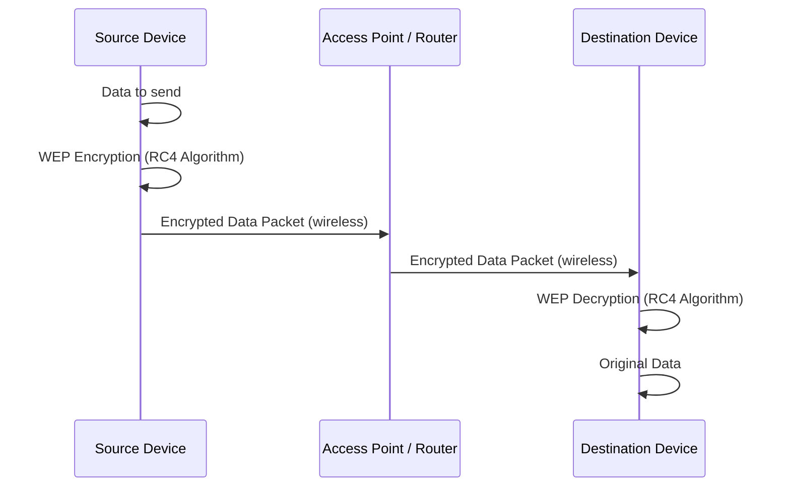

# Network Hacking - Gaining Access WEP Cracking

- Everything we did so for now didn't require us to have access/connection to the network.
- Now, once we connect to the network, we can not only start to see the data being transmitted, but we can also start to manipulate it.

---

## Theory behing cracking WEP Encryption

- WEP stands for Wired Equivalent Privacy.
- It is an older security protocol designed to provide a wireless local area network (WLAN) with a level of security and privacy comparable to what is usually expected of a wired LAN.
- It uses RC4 algorithm for encryption.
- It is still used in some older netowrks, and can be cracked in a matter of minutes.

```mermaid
flowchart LR
    A[Source Device] --> B["WEP Encryption - RC4 Algorithm"]
    B --> C[Encrypted Data Packet]
    C --> D[Wireless Transmission]
    D --> E[Access Point / Router]
    E --> F[Wireless Transmission]
    F --> G[Destination Device]
    G --> H["WEP Decryption - RC4 Algorithm"]
    H --> I[Original Data]

    style B fill:#f9f,stroke:#333,stroke-width:2px
    style H fill:#f9f,stroke:#333,stroke-width:2px
    style C fill:#bbf,stroke:#333,stroke-width:1px
```

  

