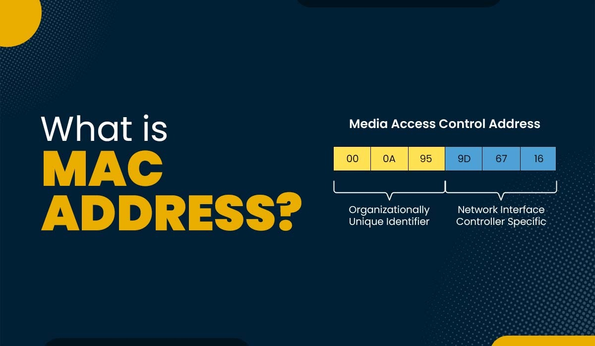

# Writing A MAC Address Changer

  

- MAC stands for `Media Access Control`. It is a permanent, physical and unique address assigned to network interfaces by the device manufacturer.
- So, whether you have a wireless card or wired or ethernet card, each of them come with a specific address that is unique to the card, so there are no 2 devices in the world with the same MAC Address.
- This address will always be the same to this specific device, even if we unplug it from our computer, and connect it to another computer. Then this network device will always have the same address.
- IP Address is used to identify computers in the network, and communicate between the devices on the Internet.
- The MAC Address is used within the network to identify devices and transfer data b/w them. So, each piece of data or packet that is sent within the network contains a source MAC and Destination MAC. Therefore, this packet will flow from the Source MAC to Destination MAC.

## Why change MAC Address??

- Because this is a unique physical address to each interface, to each network device, and used to identify devices, changing it will make you anonymous on the network.
- Lets you impersonate another device, and allows you to do things you might not be able to do.
- It makes it able to bypass filters and connect networks that only specific devices with specific MAC Addresses can only connect to, and also able to hide your identity.

## How to change MAC Address??

- Run `ifconfig` command on the computer. This will list all the interfaces available on the computer. When we say interface, we mean a network card. When we execute the command it shows `eth0` which is a virtual interface.

    

- `eth0` is not real. It is created by the virtual box, because the VM is set to use a NAT network, by default. It thinks that it is connected to a wired network. All this is done using a Virtual Interface connected to the Virtual Wired Network.
- We can also see `lo` which is also a virtual interface created by `linux`.

- The `ifconfig` command also lists down the detailed information about each of these interfaces.

- Now, to change the MAC Address of the Interface, we must first disable the interface.

  ```shell
  ifconfig ${interface_name} down
  ```

  If you don't see any errors, it means the command got executed properly. Now that the interface is disabled, we can modify its options. And, the option that we want to modify in our case is the `ether`, which is the MAC Address.

- We can now change the MAC Address using the command:

  ```bash
  ifconfig ${interface_name} hw ether ${new_mac_address}
  ```

- Now, we need to again re-enable the interface using the following command:

  ```bash
  ifconfig ${interface_name} up
  ```

  If we don't see the error it means the command got executed properly.

- Now, use `ifconfig` command again to check if the MAC Address has changed again or not. Now, if you look at the `ether` option of the `interface_name` we have been using so far, it's been modified to what we have set.

  

- Following are the proof for proper execution of these statements:

    ```shell
    root@kali:~# ifconfig
    eth0: flags=4163<UP,BROADCAST,RUNNING,MULTICAST>  mtu 1500
            inet 172.16.47.128  netmask 255.255.255.0  broadcast 172.16.47.255
            inet6 fe80::20c:29ff:fee0:ab03  prefixlen 64  scopeid 0x20<link>
            ether 00:0c:29:e0:ab:03  txqueuelen 1000  (Ethernet)
            RX packets 809954  bytes 1184345755 (1.1 GiB)
            RX errors 0  dropped 0  overruns 0  frame 0
            TX packets 70404  bytes 5559742 (5.3 MiB)
            TX errors 0  dropped 0 overruns 0  carrier 0  collisions 0
            device interrupt 45  memory 0x3fe00000-3fe20000  

    lo: flags=73<UP,LOOPBACK,RUNNING>  mtu 65536
            inet 127.0.0.1  netmask 255.0.0.0
            inet6 ::1  prefixlen 128  scopeid 0x10<host>
            loop  txqueuelen 1000  (Local Loopback)
            RX packets 86  bytes 5923 (5.7 KiB)
            RX errors 0  dropped 0  overruns 0  frame 0
            TX packets 86  bytes 5923 (5.7 KiB)
            TX errors 0  dropped 0 overruns 0  carrier 0  collisions 0

    root@kali:~# ifconfig eth0 down
    root@kali:~# ifconfig eth0 hw ether 00:11:22:33:44:55
    root@kali:~# ifconfig eth0 up
    root@kali:~# ifconfig
    eth0: flags=4163<UP,BROADCAST,RUNNING,MULTICAST>  mtu 1500
            inet 172.16.47.129  netmask 255.255.255.0  broadcast 172.16.47.255
            inet6 fe80::211:22ff:fe33:4455  prefixlen 64  scopeid 0x20<link>
            ether 00:11:22:33:44:55  txqueuelen 1000  (Ethernet)
            RX packets 809962  bytes 1184347117 (1.1 GiB)
            RX errors 0  dropped 0  overruns 0  frame 0
            TX packets 70422  bytes 5561664 (5.3 MiB)
            TX errors 0  dropped 0 overruns 0  carrier 0  collisions 0
            device interrupt 45  memory 0x3fe00000-3fe20000  

    lo: flags=73<UP,LOOPBACK,RUNNING>  mtu 65536
            inet 127.0.0.1  netmask 255.0.0.0
            inet6 ::1  prefixlen 128  scopeid 0x10<host>
            loop  txqueuelen 1000  (Local Loopback)
            RX packets 86  bytes 5923 (5.7 KiB)
            RX errors 0  dropped 0  overruns 0  frame 0
            TX packets 86  bytes 5923 (5.7 KiB)
            TX errors 0  dropped 0 overruns 0  carrier 0  collisions 0

    ```

## Using Python Modules to Execute System Commands

- We can use Python Modules to execute system commands.
- The `subprocess` module contains a number of functions for this purpose.
- It can execute any command, doesn't necessarily have to be a linux command.
- If we execute the script from Windows, it will allow us to execute windows commands. If we run scripts on mac, it will allow you to execute mac commands. If you run from linux, it let's you run linux based commands.
- In our case, we will be using the `subprocess` module to execute the `ifconfig` command, and change the MAC Address of the interface.
- The `subprocess` module contains a number of functions for this purpose. All of them are used to execute system commands, and return the output of the command, but in different ways.
- For example, some of them will run commands in the background, some in foreground, some will return the output of the command, some will not, some will return the error if any, some will not.

>[!IMPORTANT]
>The function that we will be using today is `subprocess.call()`. This function is used to run a command in the foreground, and return the exit code of the command. If the command is executed successfully, it returns `0`, otherwise it returns the error code.
>It doesn't run it in a different thread, so it will block the execution of the script until the command is executed.

- This will be very important because we don't want our script to move forward until the command is executed, and the MAC Address is changed.

- Now, let's write a simple script to change the MAC Address of the interface.

    ```python
    # Program to change MAC Address of an interface

    import subprocess
    def change_mac(interface, new_mac):
        print(f"[+] Changing MAC address of {interface} to {new_mac}")
        # Execute the command to change the MAC address
        subprocess.call(["sudo", "ifconfig", interface, "down"],shell=True)
        subprocess.call(["sudo", "ifconfig", interface, "hw", "ether", new_mac],shell=True)
        subprocess.call(["sudo", "ifconfig", interface, "up"],shell=True)
        print("[+] MAC address changed successfully")
        
    # Example usage
    if __name__ == "__main__":
        interface = input("Enter the interface name (e.g., eth0, wlan0): ")
        new_mac = input("Enter the new MAC address (format: xx:xx:xx:xx:xx:xx): ")
        change_mac(interface, new_mac)
        print(f"New MAC address for {interface} is {new_mac}")
        # Verify the change
        subprocess.call(["ifconfig", interface],shell=True)
        print(f"[+] Verification complete for {interface}.")
    ```

  Once executed we get the following output:

    ```bash
    (.venv) root@kali:~/PycharmProjects/hacking-tutorial# python mac-address-change.py 
    Enter the interface name (e.g., eth0, wlan0): eth0
    Enter the new MAC address (format: xx:xx:xx:xx:xx:xx): 3c:b9:aa:d1:42:32
    [+] Changing MAC address of eth0 to 3c:b9:aa:d1:42:32
    [+] MAC address changed successfully
    New MAC address for eth0 is 3c:b9:aa:d1:42:32
    eth0: flags=4099<UP,BROADCAST,MULTICAST>  mtu 1500
            inet 172.16.47.133  netmask 255.255.255.0  broadcast 172.16.47.255
            inet6 fe80::211:22ff:fe33:4455  prefixlen 64  scopeid 0x20<link>
            ether 3c:b9:aa:d1:42:32  txqueuelen 1000  (Ethernet)
            RX packets 812230  bytes 1185567088 (1.1 GiB)
            RX errors 0  dropped 0  overruns 0  frame 0
            TX packets 72191  bytes 5808154 (5.5 MiB)
            TX errors 0  dropped 0 overruns 0  carrier 0  collisions 0
            device interrupt 45  memory 0x3fe00000-3fe20000  

    [+] Verification complete for eth0
    ```

- In the program, we didn't use `shell=True` in the `subprocess.call()` function. This is because we are passing the command and its arguments as a list, which is the recommended way to avoid shell injection vulnerabilities. If you use `shell=True`, you should be very careful about the input to avoid executing arbitrary commands.


